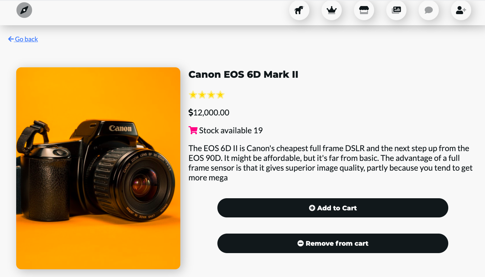
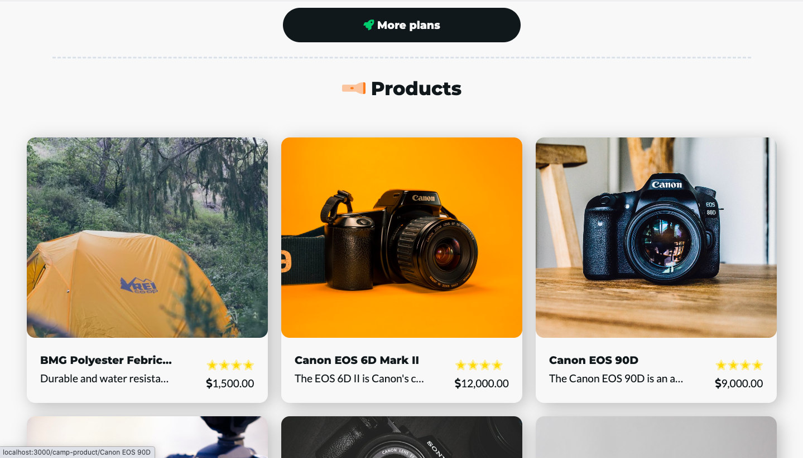
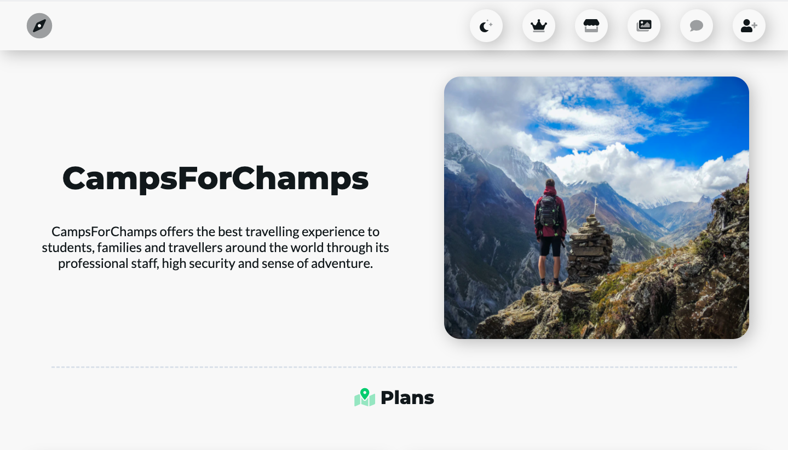

# camps_for_champs

## Project goal

The project was to create a responsive and beautiful eCommerce web app with payment gateway which is scalable.

## 🔥 Features/Services should provide

👉 Admin panel
👉 Camp plans listing
👉 Camping products listing
👉 Separate Carts for camp plans and products
👉 The backend should be an API (for scalability)
👉 The frontend should be client side rendering
👉 Users can create account with their email and will have a profile section
👉 A blog section where the admin can post, users can like/dislike, comment and reply
👉 A gallery section where the admin can put their camping images, etc...
👉 A payment gateway from where users can pay during checkout
👉 Beautiful, modern and responsive web UI  
less
Show less text

## Solution

✅ React is used for frontend and Django(Django REST framework) is used for the backend
✅ For frontend UI design Figma is used and for styling Sass is used
✅ Due to Django ORM any relational database can be connected in the backend
✅ For payment gateways Stripe(industry standard) and Braintree are used

## Images

